# 🛡️ Windows Enterprise Administration & Security Lab

### بيئة متكاملة لإدارة وتأمين أنظمة Windows ورصد التهديدات

---

##  Project Overview

يقدم هذا المشروع تطبيقًا عمليًا متكاملًا لبناء وإدارة وتأمين بيئة **Windows Enterprise**، بدءًا من إنشاء **Active Directory Domain Services (AD DS)** وتنظيم المستخدمين والأجهزة والمجموعات، مرورًا بتطبيق إجراءات **Security Hardening**، ووصولًا إلى جمع وتحليل السجلات الأمنية باستخدام **Sysmon** و **Splunk SIEM**.

يتضمن المشروع أيضًا محاكاة لهجوم **SMB Brute Force** باستخدام Kali Linux، واكتشاف الهجوم وتحليله من خلال Windows Security Logs وSplunk، مع ربط السيناريو بإطار **MITRE ATT&CK** وتطبيق إجراءات الاستجابة للحوادث.

---

#  Infrastructure & Lab Environment

| Component | Description |
|---|---|
| **DC01** | Windows Server – Active Directory, DNS, DHCP |
| **PC01** | Windows Client – Domain Joined |
| **Splunk Enterprise** | SIEM & Log Analysis |
| **Splunk Universal Forwarder** | Centralized Log Collection |
| **Sysmon** | Endpoint Monitoring |
| **Kali Linux** | Attack Simulation |
| **Domain** | `corp.local` |
| **Network** | `192.168.10.0/24` |

### 🌐 Network Configuration

```text
DC01        → 192.168.10.10
PC01        → 192.168.10.20
Kali Linux  → 192.168.10.50
Domain      → corp.local
Network     → 192.168.10.0/24

```
---


# 1️⃣ المرحلة الأولى: بناء البيئة الرقمية (Build)
### Active Directory Domain Services
  
## أولًا إعداد Windows Server 
نم تثبيت خدمات النطاق (AD DS) وإنشاء Domain خاص بالبيئة تحت مسمى corp.local. كما تم إعداد Domain Controller وخدمات DNS لدعم بيئة Active Directory.

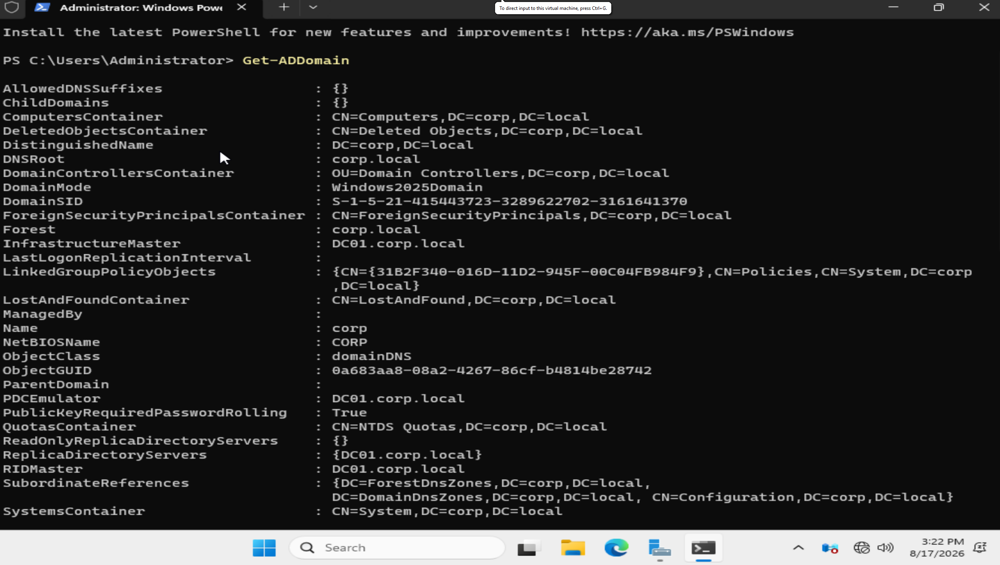
*التحقق من تفاصيل وخصائص النطاق (Active Directory Domain) بعد إتمام عملية التثبيت على خادم DC01.*


### اعدادات DNS Configuration
تم إعداد DNS وربطه بمتحكم النطاق لضمان قدرة أجهزة البيئة على الوصول إلى خدمات Active Directory وحل أسماء الدومين.
تم التحقق من دقة الاستعلام (DNS Resolution) باستخدام الأوامر التالية:

```
nslookup corp.local
```
```
Resolve-DnsName corp.local -Server 127.0.0.1
```


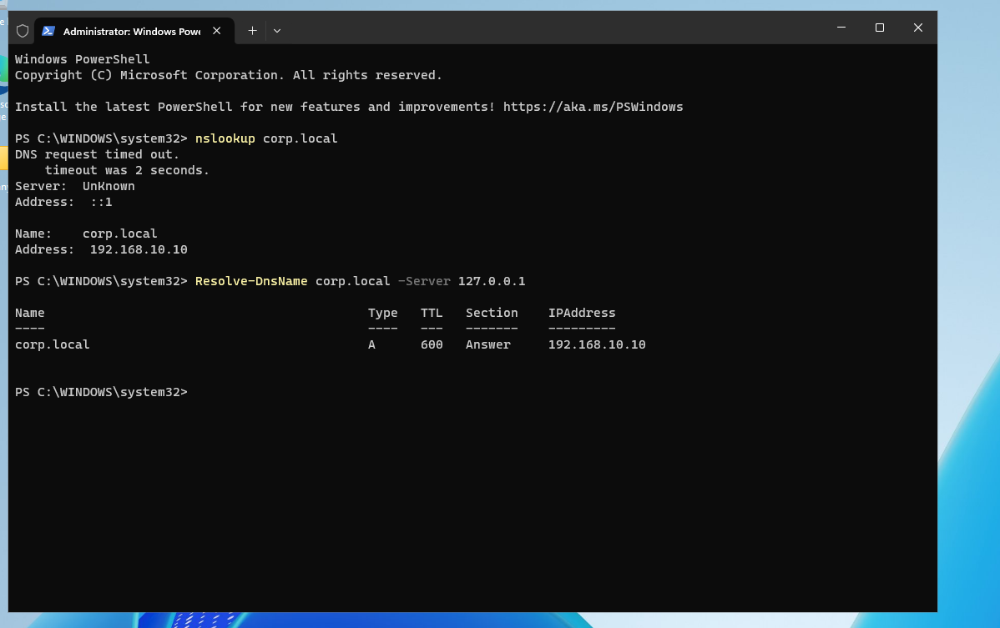
*اختبار دقة استعلام وحل أسماء النطاقات (DNS Resolution) باستخدام أدوات nslookup و Resolve-DnsName.*


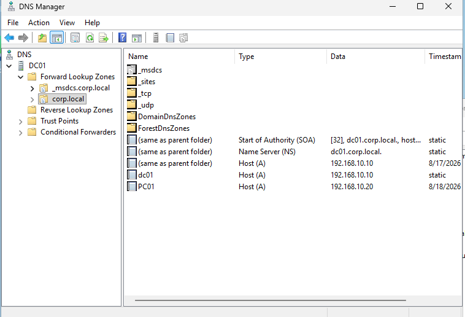

*استعراض واجهة مدير خدمات النطاق (DNS Manager) للتأكد من سلامة سجلات الـ Forward Lookup Zones.*


### اعدادات DHCP Configuration
تم إعداد DHCP لتوفير إعدادات الشبكة (IP, Subnet, Gateway) للأجهزة العميلة داخل بيئة الـ Lab تلقائياً، والتحقق من إعدادات المضيف عبر الأوامر.

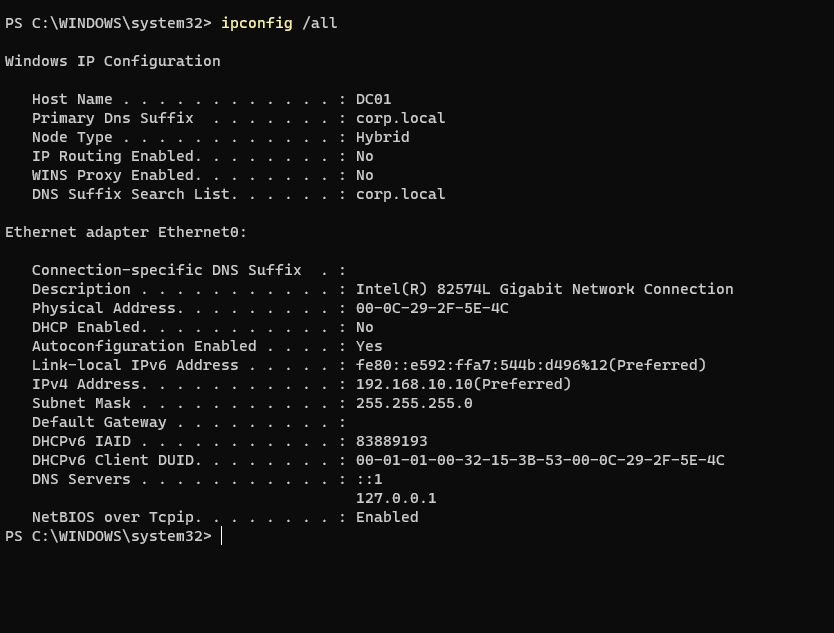

*التحقق من إعدادات الشبكة وعنوان الـ IP الثابت لخادم النطاق (DC01) باستخدام أمر ipconfig /all.*


### تأسيس Active Directory والهيكل التنظيمي (AD Forest & OUs)

تم تنفيذ أمر تثبيت Forest وتشغيل أوامر PowerShell لإنشاء النطاق `corp.local` مع تعيين كلمات المرور الآمنة.

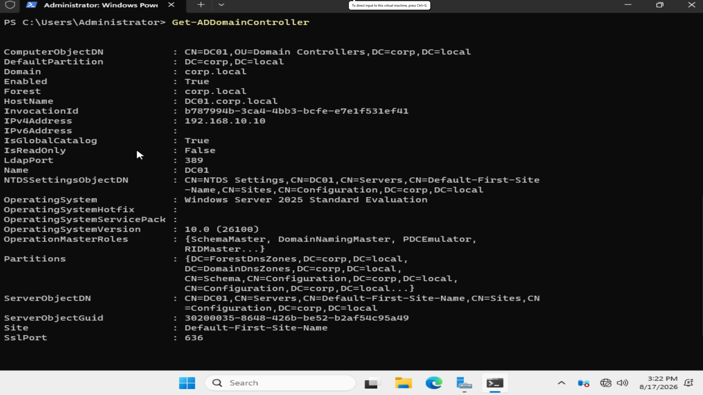
*استعراض وتأكيد حالة خادم متحكم النطاق (Domain Controller) وخصائص الـ Forest عبر أوامر PowerShell.*


### 🏢 استعراض الهيكل التنظيمي للوحدات (OUs)

تم استخدام أوامر PowerShell لاستعراض وتأكيد بناء الهيكل التنظيمي وتوزيع الأقسام الرئيسية (`HR, Finance, IT, Management`) داخل بيئة النطاق.

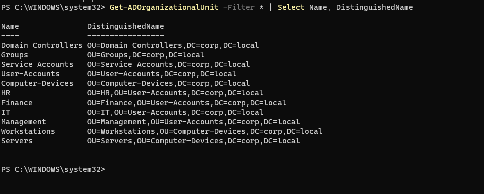

*عرض نتائج استعلام الوحدات التنظيمية (OUs) والمسارات الخاصة بها (DistinguishedName) عبر PowerShell.*


---

## ثانيًا: إعداد جهاز العميل (Client Workstation Setup)
في هذه المرحلة، يتم إعداد جهاز العميل (Windows 10/11 - PC01) ليكون جاهزاً للعمل ضمن بيئة النطاق (Domain) وتجهيزه لجمع السجلات الأمنية وتحليلها.

###  التحقق من الاتصال (Connectivity & DNS Testing):
تم التحقق من سلامة الاتصال بالشبكة والوصول إلى خادم الـ Domain Controller، والتأكد من قدرة الجهاز على حل أسماء النطاقات (DNS Resolution).

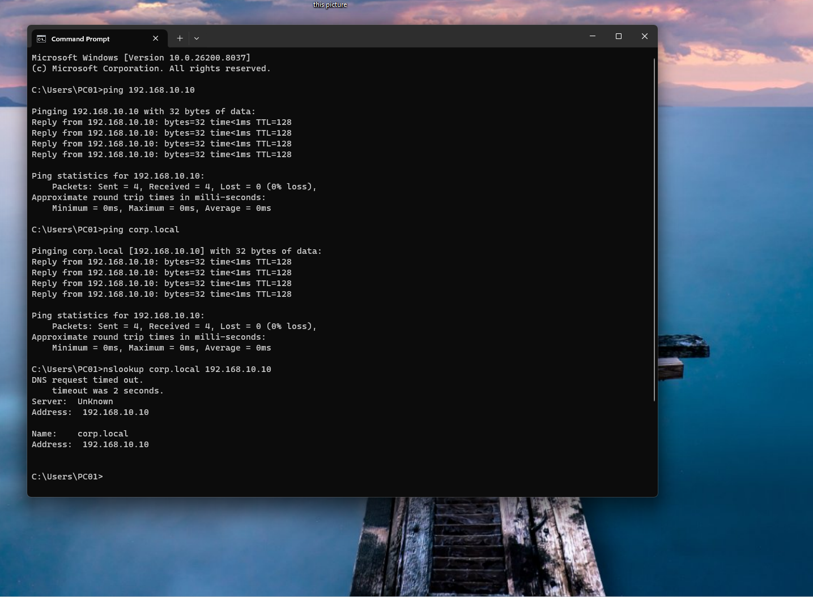
*اختبار الاتصال بالشبكة باستخدام ping وفحص خادم الـ DNS للتأكد من ربط الجهاز ببيئة الـ Lab.*

###  تثبيت وتكوين أداة المراقبة (Sysmon Configuration):
تم تثبيت أداة Sysmon على جهاز العميل وتطبيق ملف الإعدادات المخصص (Configuration file) لضمان مراقبة العمليات والأنشطة المشبوهة بدقة عالية.

```cmd
sysmon64.exe -c sysmonconfig-export.xml
```
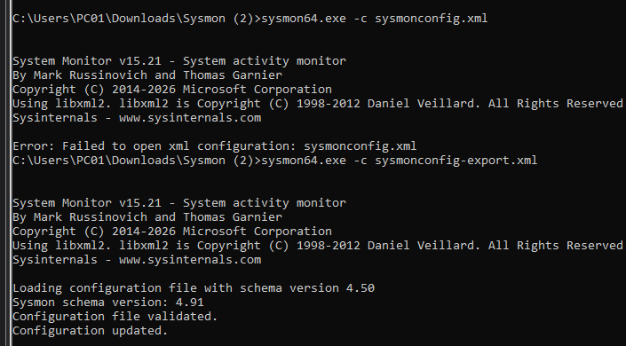


*تحديث وتثبيت إعدادات Sysmon بنجاح عبر موجه الأوامر على جهاز العميل (PC01) بعد استخدام ملف التهيئة المخصص.*


---
# 2️⃣ الهيكل التنظيمي للوحدات (Organizational Units — OUs)
تم تصميم هيكل تنظيمي يحاكي بيئة مؤسسة حقيقية، مع فصل المستخدمين والأجهزة والحسابات حسب الوظيفة كالتالي:
```
corp.local
│
├── User-Accounts
│   ├── HR
│   ├── Finance
│   ├── IT
│   └── Management
│
├── Computer-Devices
│   ├── Workstations
│   └── Servers
│
├── Groups
│
├── Service Accounts
│
└── Domain Controllers
```
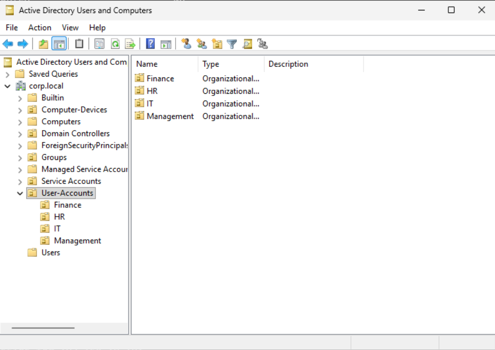


---
# 3️⃣ إدارة الحسابات والمستخدمين (User & Account Management)
تم إنشاء حسابات المستخدمين وتوزيعها على الـ OUs المناسبة حسب الأقسام الوظيفية.

عينة من الحسابات (Sample Accounts):

- Ali Ahmed
- Sara HR
- Omar Finance
- Mona Manager
- Lina Security
- IT Admin

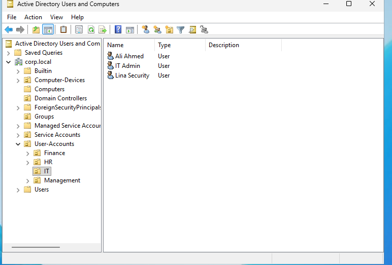

---
# 4️⃣ المجموعات الأمنية (Security Groups & RBAC)
تم إنشاء مجموعات أمنية عالمية (Global Security Groups) لتطبيق مبدأ التحكم في الوصول المستند إلى الدور (Role-Based Access Control - RBAC):

- GG-IT-Users
- GG-HR-Users
- GG-Finance-Users
- GG-Management-Users
- GG-IT-Admins
- GG-Security-Analysts

  
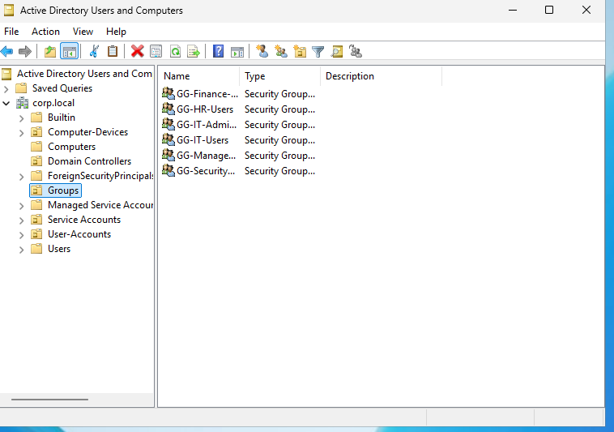


---
# 5️⃣ تنظيم الأجهزة والخوادم (Computer & Server Organization)
تم إنشاء هيكل منفصل لإدارة أجهزة المؤسسة لتسهيل تطبيق السياسات (GPOs) المخصصة لكل نوع:
```
Computer-Devices
│
├── Workstations
└── Servers
```

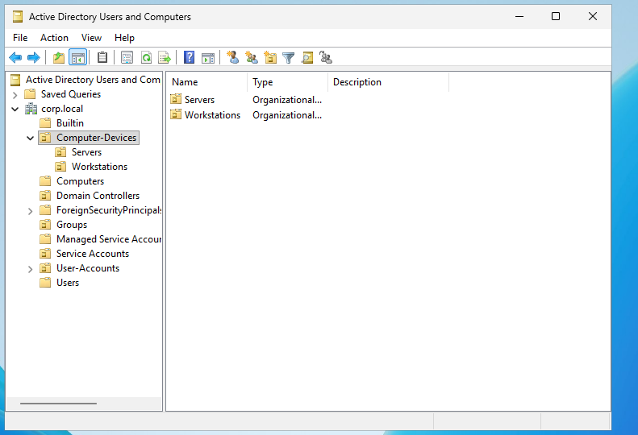

---
# 6️⃣ الانضمام للنطاق (Domain Join)
تم ربط جهاز العميل PC01 بالنطاق corp.local ليصبح جزءًا من بيئة Active Directory ويستفيد من سياسات الدومين والمصادقة المركزية.


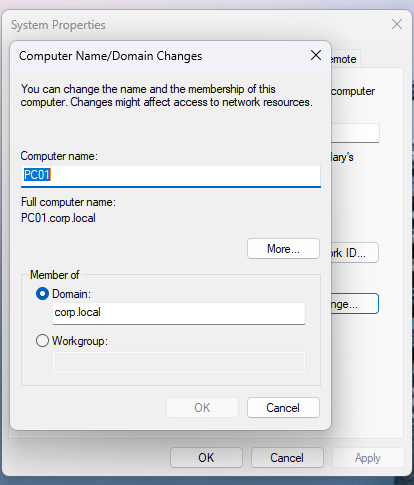


*توثيق نجاح انضمام جهاز العميل (PC01) إلى النطاق (corp.local) عبر إعدادات خصائص النظام.*

---

# 7️⃣ إدارة الأنظمة (Administration)
* 🔐 إدارة الحسابات والصلاحيات (Account & Permission Management)
تم تطبيق مبادئ أمنية قياسية تشمل:Role-Based Access Control (RBAC).
مبدأ الصلاحيات الأقل (Least Privilege).
إدارة الحسابات الإدارية وحسابات الخدمات (Service Accounts).
### 📁 إدارة الصلاحيات ومشاركة المجلدات (File Sharing & Permissions)

تم إعداد موارد مشاركة الملفات وتطبيق الصلاحيات بدقة وفق مبدأ الصلاحيات الأقل (*Least Privilege*) والتحكم القائم على الأدوار (*RBAC*).

#### 1. صلاحيات المشاركة عبر الشبكة (Share / SMB Permissions)
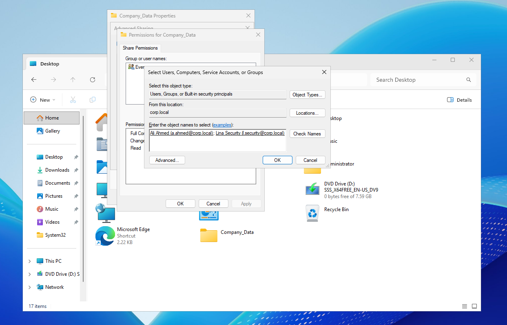
*تكوين صلاحيات المشاركة لمجلد Company_Data ومنح الوصول لمستخدمي نطاق Active Directory (corp.local).*

#### 2. صلاحيات نظام الملفات المحلي (NTFS Permissions)
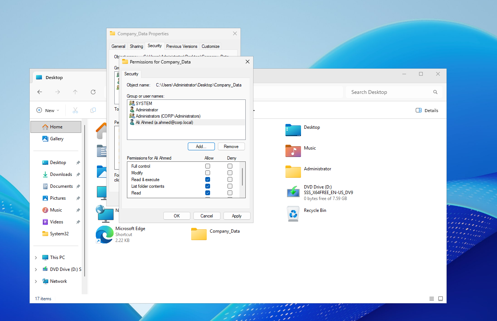
*إعداد وتطبيق صلاحيات نظام الملفات (NTFS Permissions) للمستخدم Ali Ahmed على مجلد Company_Data لضمان تقييد الوصول.*


---


## 🔒 8️⃣ التصليد الأمني (Security Hardening)
تطبيق مجموعة من إجراءات تقليل سطح الهجوم وتحسين الوضع الأمني.

* **🔐 سياسات قفل الحسابات وكلمات المرور:**
  * **تطبيق تعقيد كلمات المرور (Password Complexity):**
  
  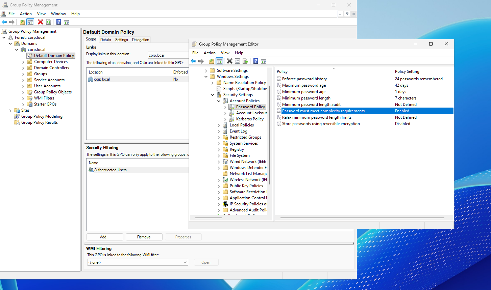
  *إعدادات سياسة كلمات المرور (Password Policy) وتفعيل شروط التعقيد ضمن سياسات المجموعة (GPO).*

  * **سياسة الحظر التلقائي (Account Lockout Policy):** للحد من هجمات التخمين.
  
  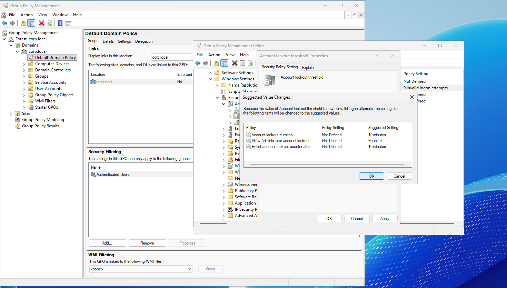
  *إعدادات سياسة الحظر التلقائي (Account Lockout Policy) وتحديد عدد محاولات الدخول الفاشلة لتعطيل الحساب المؤقت.*

  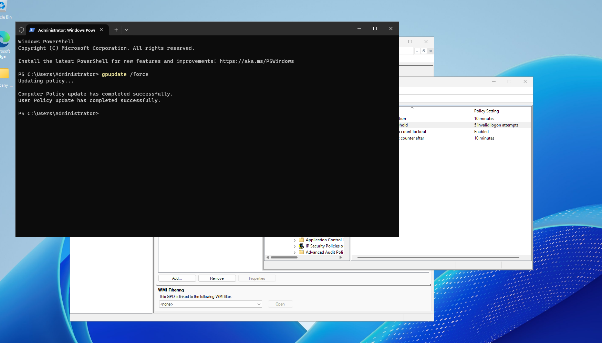
  *تحديث سياسات المجموعة يدوياً عبر موجه الأوامر (PowerShell) باستخدام الأمر `gpupdate /force` لتطبيق الإعدادات الأمنية.*

  * **إعدادات سجل النظام (Registry Hardening):** 
  التحقق من مفاتيح وقيم الأمان وتطبيق سياسات التحكم في الحسابات (UAC) وسلوكيات النظام مباشرة عبر السجل.
  
  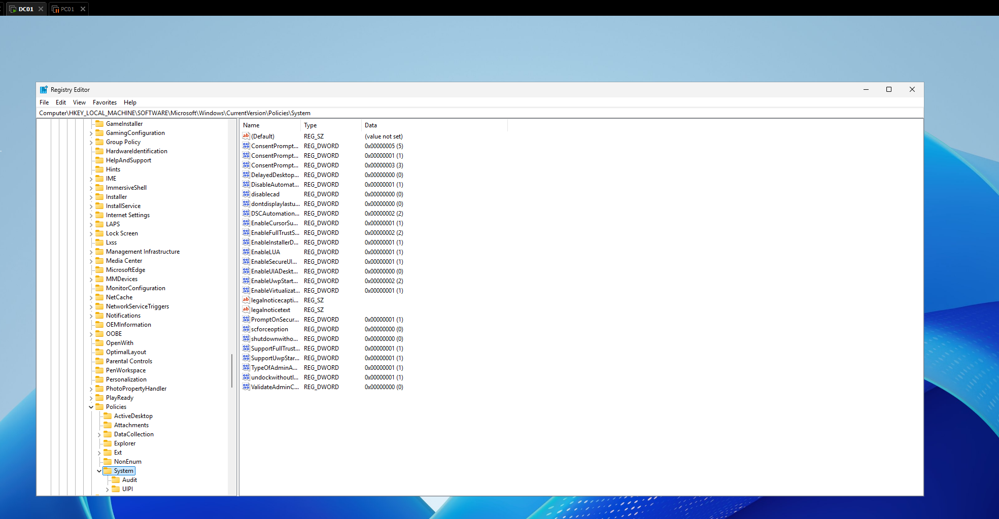
  *استعراض وضبط مفاتيح الأمان والسياسات الخاصة بالنظام (مثل إعدادات UAC والتحكم بالحسابات) من خلال محرر السجل (Registry Editor).*

---
---

* **🛡️ الحماية والجدار الناري:**
  * تفعيل Windows Defender.
  * ضبط إعدادات وقواعد Windows Firewall.

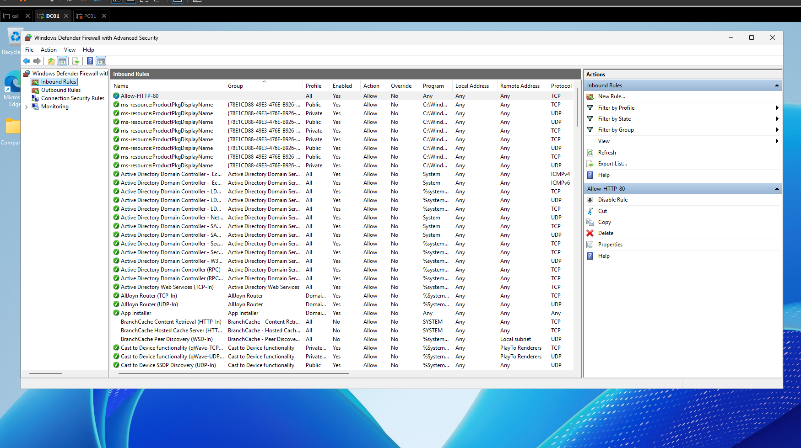
*استعراض وإدارة قواعد الوارد (Inbound Rules) في جدار حماية ويندوز المتقدم لتأمين خدمات الشبكة.*

---

* **🔎 التدقيق المتقدم (Advanced Auditing):**
  * تفعيل سياسات التدقيق المتقدمة لتسجيل الأنشطة الأمنية الحساسة ومتابعة محاولات الدخول.

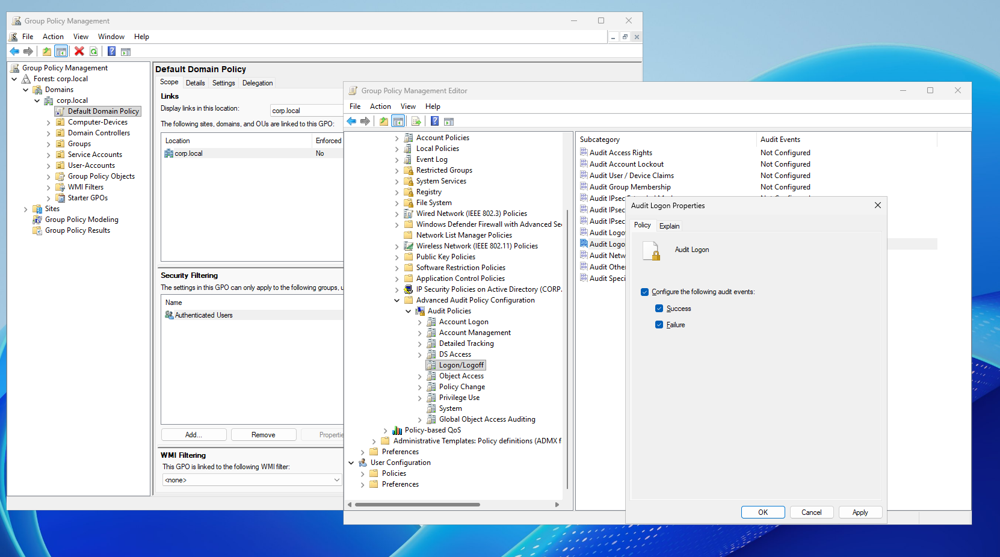
*تفعيل سياسات التدقيق المتقدم (Advanced Audit Policy) لمراقبة وتسجيل أحداث تسجيل الدخول الناجحة والفاشلة.*

---

* **إدارة وتعطيل الخدمات الحساسة (System Services Hardening):**
  * إيقاف وتعطيل الخدمات غير الضرورية أو التي تشكل خطراً أمنياً مثل Remote Registry لتقليل سطح الهجوم.

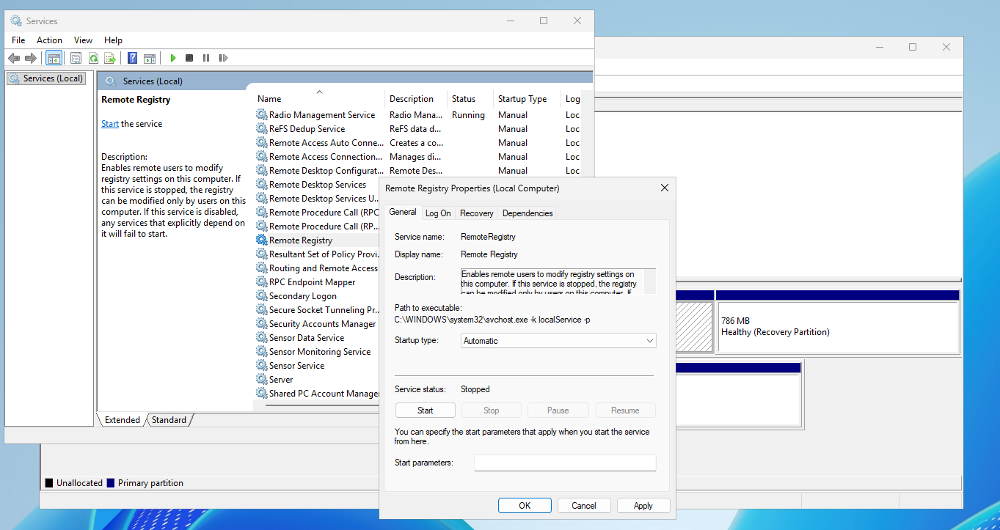
*إدارة وتكوين خدمة الريجستري عن بُعد (Remote Registry) ضمن خدمات نظام التشغيل لتأمين بيئة العمل.*

---

# 9️⃣ المراقبة الطرفية (Sysmon — Endpoint Monitoring)
تم استخدام أداة Sysmon لمراقبة الأجهزة وتوفير معلومات تفصيلية عن العمليات والأنشطة الشبكية.

* **أهم الأحداث المرصودة:** Sysmon Event ID 1 (Process Creation)

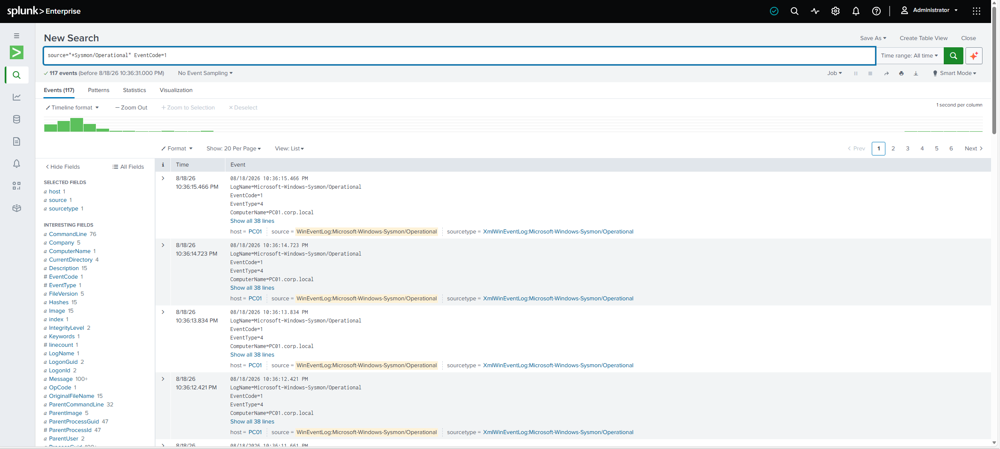
*استعلام في Splunk لعرض أحداث إنشاء العمليات (Sysmon EventCode=1) وتتبع العمليات المشبوهة على جهاز العميل PC01.*


---
# 🔟 إدارة السجلات الأمنية (Splunk SIEM)
تم بناء مسار مركزي لجمع وتحليل السجلات بشكل فوري:
```
[ Windows Event Logs + Sysmon ]
             │
             ▼
[ Splunk Universal Forwarder ]
             │
             ▼
[ Splunk Enterprise ] (Detection & Investigation)
```

---

## 🔍 استعلامات الرصد (SPL Queries)

### 📌 رصد هجوم التخمين (Brute Force Statistics):
يستخدم لاكتشاف وإحصاء أحداث تسجيل الدخول الفاشلة المرتبطة بمحاولات التخمين على النظام.

```
index=* (EventCode=4625 OR EventCode=4104 OR EventCode=4728 OR EventCode=4732)
| stats count by EventCode, host
```
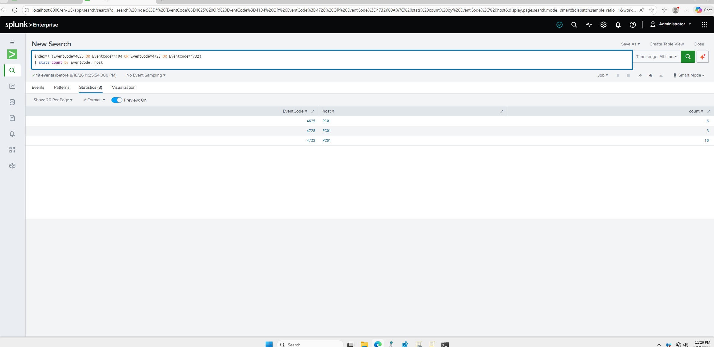

*نتائج استعلام Splunk لجمع وتحليل إحصائيات أحداث الدخول الفاشلة وأكواد التهديدات الأمنية المرصودة على الجهاز.*

تتبع العمليات الأكثر تنفيذاً (Sysmon Process Monitoring):
يستخدم لتحليل وتتبع العمليات والتطبيقات الأكثر تنفيذاً عبر سجلات Sysmon (EventCode 1).

```
source="*Sysmon/Operational" EventCode=1
| stats count by Image
| sort - count
```

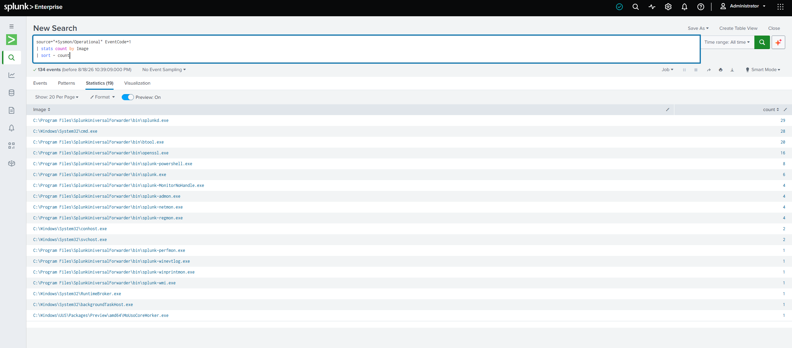
*استعلام إحصائي في Splunk لتتبع وترتيب أكثر العمليات والتطبيقات تنفيذاً عبر سجلات Sysmon (EventCode 1).*

اكتشاف هجوم التخمين وتحديد المصدر (Brute Force Attack Detected):
يستخدم لاكتشاف المصادر التي تجاوزت حدًا معينًا من محاولات الدخول الفاشلة وتحديد عناوين الـ IP والمستخدمين المستهدفين.
```
index=* EventCode=4625 
| stats count by Account_Name, Workstation_Name, Source_Network_Address 
| where count >= 5
```
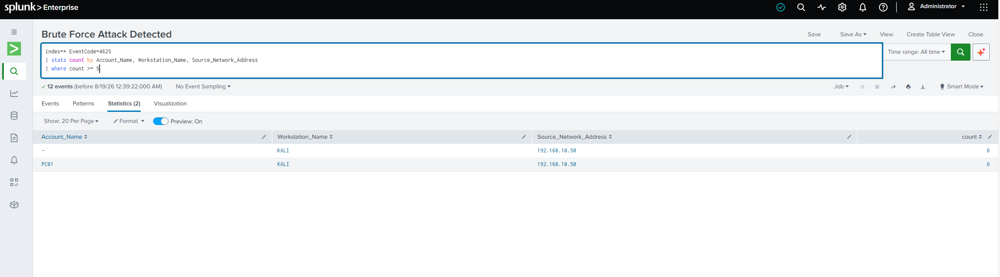
*تقرير واكتشاف هجوم Brute Force في Splunk يظهر تفاصيل المصدر (KALI / 192.168.10.50) والحسابات المستهدفة بعد تجاوز حد محاولات الدخول الفاشلة.*


---
### التحقيق الجنائي الرقمي (Forensic Investigation):
يستخدم لاستخراج المعلومات الأساسية اللازمة للتحقيق.
```
index=* EventCode=4625 
| table _time, Account_Name, Workstation_Name, Source_Network_Address, Source_Port

```
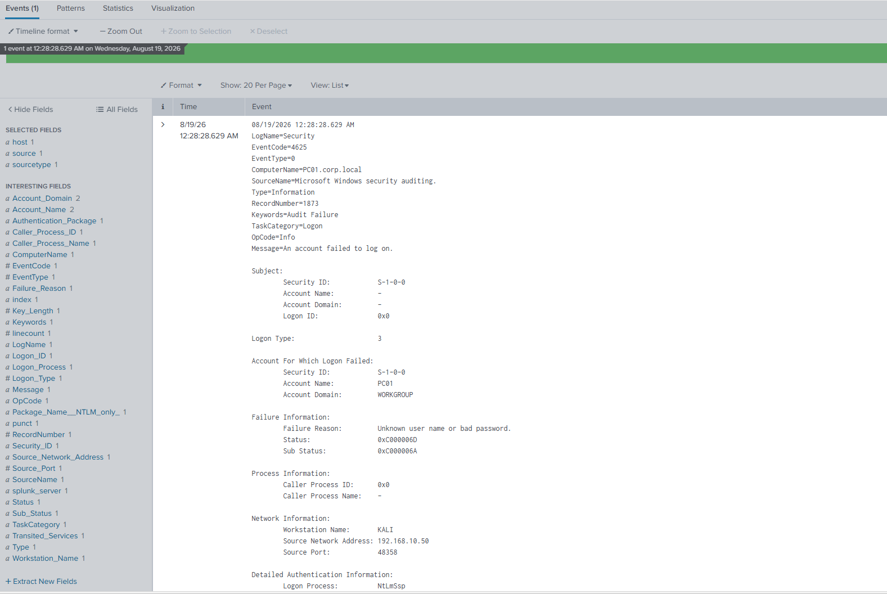 

*تفاصيل حدث محاولة تسجيل الدخول الفاشلة (EventCode=4625) في Splunk وتظهر فيها تفاصيل IP جهاز كالي لينكس وسبب الفشل.*


### 📌 عرض تفاصيل العمليات المنفذة (Process Execution Details):
يستخدم هذا الاستعلام لعرض جدول زمني تفصيلي للعمليات التي تم تنفيذها على النظام باستخدام سجلات Sysmon.

```
source="*Sysmon/Operational" EventCode=1
| table _time, host, Image, CommandLine, User
```
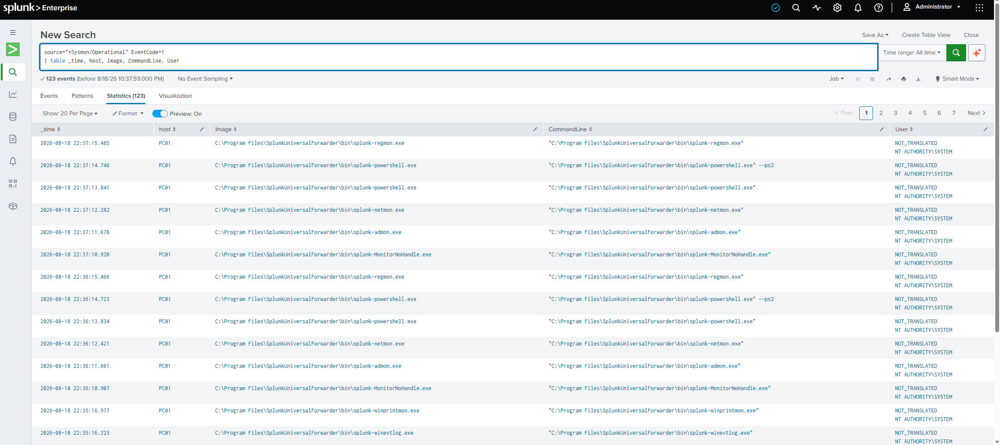
*جدول استعلام تفصيلي في Splunk يعرض تفاصيل إنشاء العمليات وأوامر التشغيل (CommandLine) والمستخدمين المرتبطين عبر سجلات Sysmon EventCode 1.*

 
---
### الاستجابة للحوادث: سيناريو هجوم (SMB Brute Force Attack)
تم تنفيذ محاكاة عملية لهجوم تخمين على خدمة SMB.
### محاكاة هجوم SMB Brute Force
تم تنفيذ هجوم تخمين كلمات المرور (Brute Force Attack) على خدمة المشاركة SMB باستخدام أداة **Hydra** من بيئة **Kali Linux** (`192.168.10.50`) ضد جهاز العميل `PC01` (`192.168.10.20`) لاختبار فعالية المراقبة ورصد محاولات الدخول الفاشلة والمتكررة.

* **الأمر المستخدم في الهجوم:**
```bash
hydra -l PC01 -P passwords.txt smb2://192.168.10.20
```
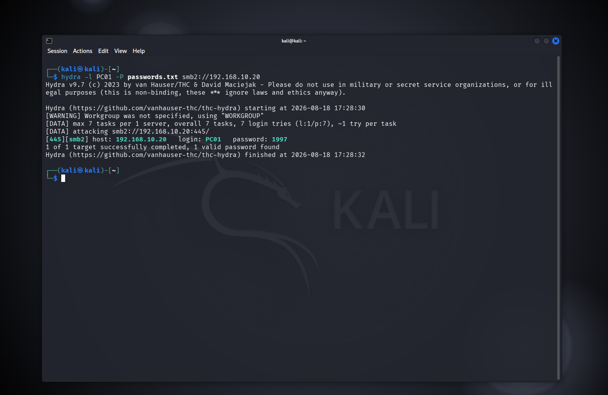
*تنفيذ هجوم SMB Brute Force عبر أداة Hydra من Kali Linux والنجاح في العثور على كلمة المرور المستهدفة.*

⚔️ سيناريو الهجوم (Attack Flow):
```
[ Attacker: Kali Linux ] 
        │ (Hydra SMB Brute Force)
        ▼
[ Target: PC01 ] 
        │ (Failed Authentication)
        ▼
[ Windows Security Event 4625 ] 
        │
        ▼
[ Splunk SIEM Detection ] 
        │ (Investigation via SPL)
        ▼
[ MITRE ATT&CK T1110 ] 
        │
        ▼
[ Containment & Remediation ]
```


---

##  تفاصيل ومؤشرات الهجوم (Attack Details & IoCs)

* **الهدف (Target):** جهاز العميل `PC01` بمعنوان شبكي `192.168.10.20`.
* **نظام المهاجم (Attacker):** `Kali Linux` بعنوان شبكي `192.168.10.50`.
* **البروتوكول المستخدم:** `SMB`.
* **نوع الهجوم:** هجوم تخمين كلمات المرور (`Brute Force`).
* **الحدث المرصود في السجلات (Event ID):** `4625 - Failed Logon` (فشل تسجيل الدخول).

---

##  تصنيف الهجوم (MITRE ATT&CK Mapping)

تم ربط الهجوم وتحليله وفق إطار العمل السيبراني العالمي MITRE ATT&CK:
* **التكتيك (Tactic):** الوصول إلى بيانات الاعتماد (`Credential Access`).
* **التقنية (Technique):** `T1110 — Brute Force`.

---

## 🛡️ الاحتواء والمعالجة (Containment & Remediation)

تم التعامل مع الحادثة الأمنية وفق دورة الاستجابة للحوادث المعتمدة:
$$\text{Detection} \rightarrow \text{Investigation} \rightarrow \text{Identification} \rightarrow \text{Containment} \rightarrow \text{Remediation}$$

* **الاستجابة الفورية:** الاعتماد الأساسي على تطبيق وتفعيل سياسة قفل الحسابات (`Account Lockout Policy`) لإيقاف هجمات التخمين آلياً وتحييد خطر المهاجم والحد من فعالية الهجوم.

---

##  الأدوات والتقنيات المستخدمة (Tools & Technologies)

* **أنظمة التشغيل:** Windows Server & Windows Client.
* **خدمات البنية التحتية:** Active Directory, DNS, DHCP, Group Policy.
* **الأتمتة والإدارة:** PowerShell.
* **الأمن والحماية:** Windows Defender & Firewall, Sysmon.
* **المراقبة وتحليل السجلات:** Splunk Enterprise & Universal Forwarder.
* **محاكاة الهجمات:** Kali Linux & Hydra.
* **الأطر المعيارية:** MITRE ATT&CK Framework.


---

##  المهارات المكتسبة والمطبقة (Skills Demonstrated)

* إدارة خوادم Windows وخدمات الـ Active Directory باحترافية.
* تصميم الهياكل التنظيمية (*OUs*) وإدارة الصلاحيات عبر نموذج التحكم القائم على الأدوار (*RBAC*).
* تطبيق سياسات التصليد الأمني (*Security Hardening*).
* المراقبة وتدقيق السجلات الأمنية المتقدمة (*Security Auditing & Sysmon*).
* بناء واستخدام أنظمة إدارة المعلومات والأحداث الأمنية (*SIEM using Splunk SPL*).
* رصد التهديدات والتحقيق الجنائي الرقمي (*Threat Detection & Digital Investigation*).
* تنفيذ الاستجابة للحوادث وربط التهديدات بإطار العمل (*MITRE ATT&CK*).


---

## 🏁 خاتمة المشروع (Project Outcome)

تم بنجاح بناء بيئة عمل مؤسسية متكاملة (`Windows Enterprise Lab`) تبدأ من إنشاء خادم النطاق ($Domain\ Controller$) وخدمات الـ $Active\ Directory$، مرورًا بإدارة المستخدمين والأجهزة وتطبيق إجراءات التصليد الصارمة، وانتهاءً ببناء منظومة مراقبة أمنية متكاملة باستخدام $Sysmon$ و $Splunk\ SIEM$.

كما نجح المعمل في محاكاة وتوثيق سيناريو هجوم اختراق حقيقي ($SMB\ Brute\ Force$)، واكتشافه وتحليله بدقة عبر السجلات الأمنية، مع تفعيل إجراءات الاستجابة والاحتواء القياسية.
يبرهن هذا المشروع بجلاء على كفاءة وقدرة عالية في تطبيق مهارات إدارة الأنظمة والأمن السيبراني في بيئات المؤسسات الحقيقية.

---
